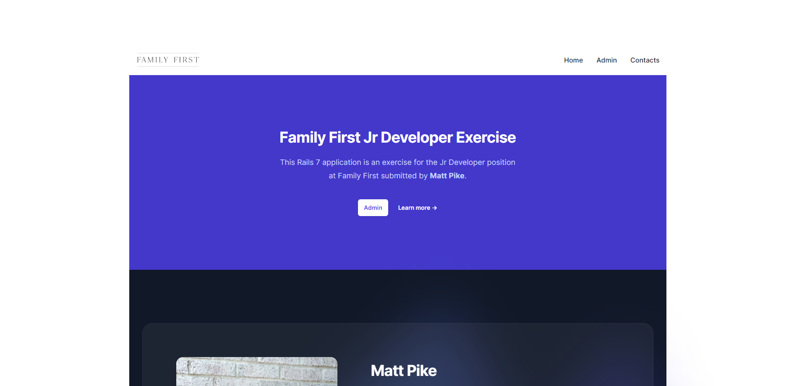
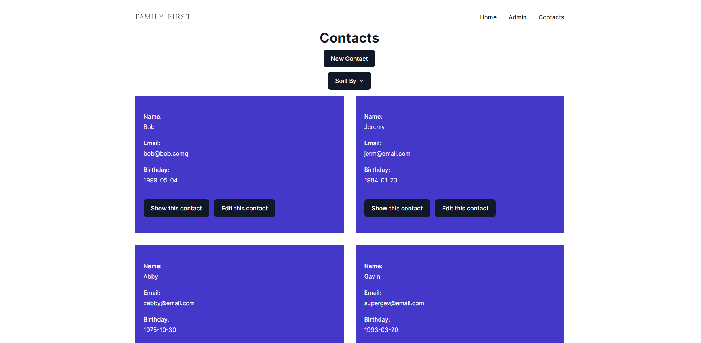

# Family First Jr Rails

This was a coding exercise assigned for the Junior Rails development position at Family First. I successfully completed all requirements and added additional features. Though they hired someone else, I was given positive feedback on my work and encouraged to continue in the direction I am heading!

Please see a few pictures of the app below, and beneath that will be the original instructions for the assignment.

  

  

  

  

  

  

  

# README

This is an exercise for our junior web developer position at Family First.

## Notes

- This Rails application already is setup to work with SQLite, Tailwind, Alpine, and ActiveAdmin. You will not need to install any new libraries or gems to complete this exercise.
- Once you have forked it into your personal Github account, you can clone it locally and run `bundle install` to install the gems. Then run `bin/dev` to start the server.
- When you create your Contact admin resource, you will get a ransackable error but the error tells you exactly what to do.
- Read carefully the comments ActiveAdmin generates in it's Contact admin page.

## Requirements

- Fork this into your personal Github account. After completing the exercise, submit a Pull Request.
- Get it running locally on your computer. You can use the default SQLite database.
- On the landing page do the following:
  - Set the applicant name as set by alpine.js and reflected throughout the page
  - Change the photo to your photo
  - Set your bio
  - Change the bullets to a list of your top strengths and skills
  - Change out the logos and names at the bottom and have them link to Ruby on Rails, ActiveAdmin, Tailwind, Alpine
- Create a model with CRUD controller and views for a Contact model with the following fields (you can choose to use scaffolding):
  - Name
  - Email
  - Birthday
- Though the default scaffold looks decent, find some ways to make it look better using Tailwind CSS
- Link to the new contacts section from the home page (anyway you think looks good)
- Create an ActiveAdmin resource for the Contact model and ensure it works to create, edit, and delete contacts
- Find a way to integrate at least one usage of Alpine into your contact pages somewhere. Examples: search field for the index, filters drop down, collapsible menus

## Resources

### Getting Started with Rails

https://guides.rubyonrails.org/getting_started.html

### Active Admin

https://activeadmin.info/

### Tailwind CSS

https://tailwindcss.com/docs/installation
